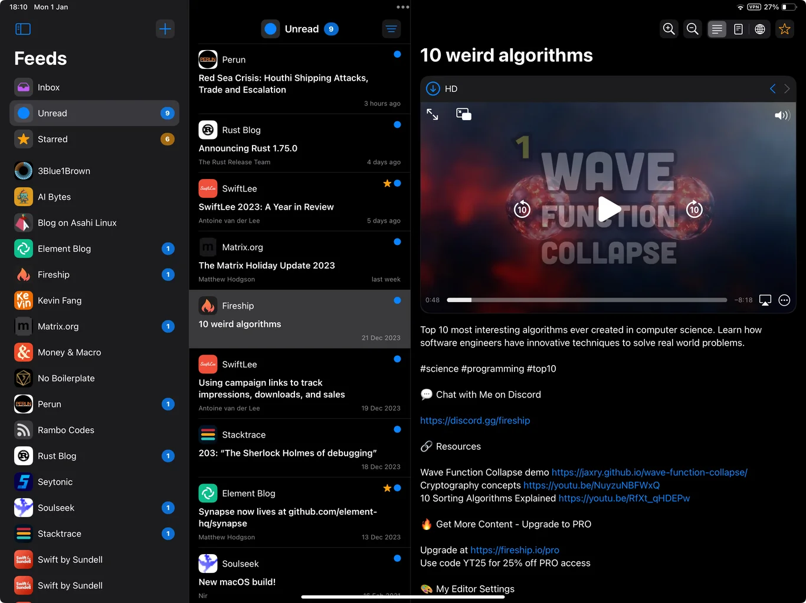
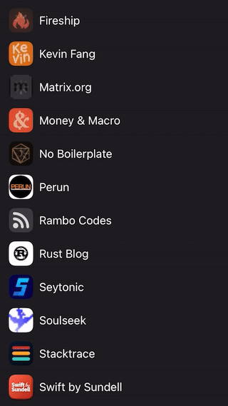
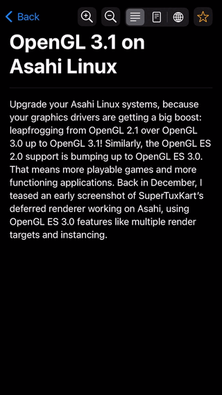

A modern Feed reader for Apple's platforms with good media support.

## Join Public Beta!

Scan the QR code or visit [**TestFlight**](https://testflight.apple.com/join/kRcbarg4) to try out the app.\
Supported platforms:
- `iOS 17.0+`
- `iPadOS 17.0+`
- `macOS 14.0+` [^1]

[^1]: Runs in *Designed for iPad* mode. An ARM MacBook required.

## Features

### Multiple Attachments

Stream Video and Audio. Preview Images.\
Save for offline use.\
**QuickLook** and **ShareSheet** integration.

       

### Parallel Fetch

Simultaneously fetching multiple feeds\
makes for a fast refresh even with many feeds.

        

### Article Extraction

Some feeds does not include full content.\
Feed Radar can extract articles\
without relying on any third party services

       

## Documentation

To learn more check out the generated [**Documentation**](https://levitatingpineapple.github.io/feed-radar/documentation/feedradar)\
A high level overview is available in following articles:

- [**Fetching Feeds**](https://levitatingpineapple.github.io/feed-radar/documentation/feedradar/fetchingfeeds)\
How feeds are fetched and mapped
- [**Storing Feeds**](https://levitatingpineapple.github.io/feed-radar/documentation/feedradar/storingfeeds)\
How feeds are persisted in database
- [**Syncing**](https://levitatingpineapple.github.io/feed-radar/documentation/feedradar/syncing)\
How the app syncs between multiple devices

## Dependencies

This project would not be possible without:

- [FeedKit](https://github.com/nmdias/FeedKit)\
Handles the complex world of feed decoding
- [Readablity](https://github.com/mozilla/readability)\
The library - used in [Firefox Reader View](https://support.mozilla.org/en-US/kb/firefox-reader-view-clutter-free-web-pages) enables article extraction
- [GRDB](https://github.com/groue/GRDB.swift)\
A robust SQLite toolkit

## Roadmap

⚠️ The project is still in a very early stage.
Some of the core functionality is yet to be added, such as:

- Finding feed url from a website
- Grouping feeds in folders
- [Conditional GET](https://developer.mozilla.org/en-US/docs/Web/HTTP/Conditional_requests)