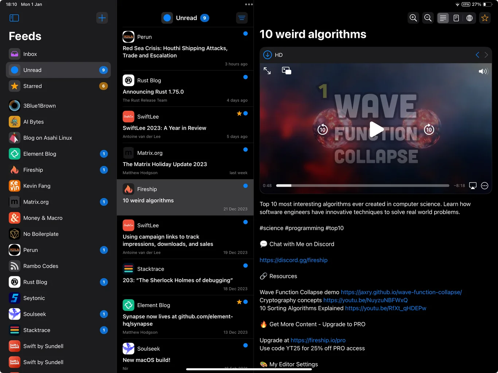

	

# Feed Radar

A modern Feed reader for Apple's platforms with good media support.

## Join Public Beta!

Scan the QR code or visit [**TestFlight**](https://testflight.apple.com/join/kRcbarg4) to try out the app.\
Supported platforms:
- `iOS 17.0+`
- `iPadOS 17.0+`
- `macOS 14.0+` [^1]

[^1]: Runs in (Designed for iPad) mode - requires an ARM Macbook

## Documentation

To learn more check out the generated [**Documentation**](https://levitatingpineapple.github.io/feed-radar/documentation/feedradar)\
A high level overview is available in following articles:

- [**Fetching Feeds**](https://levitatingpineapple.github.io/feed-radar/documentation/feedradar/fetchingfeeds)\
How feeds are fetched and mapped
- [**Storing Feeds**](https://levitatingpineapple.github.io/feed-radar/documentation/feedradar/storingfeeds)\
How feeds are persisted in database
- [**Syncing**](https://levitatingpineapple.github.io/feed-radar/documentation/feedradar/syncing)\
How the app syncs between multiple devices